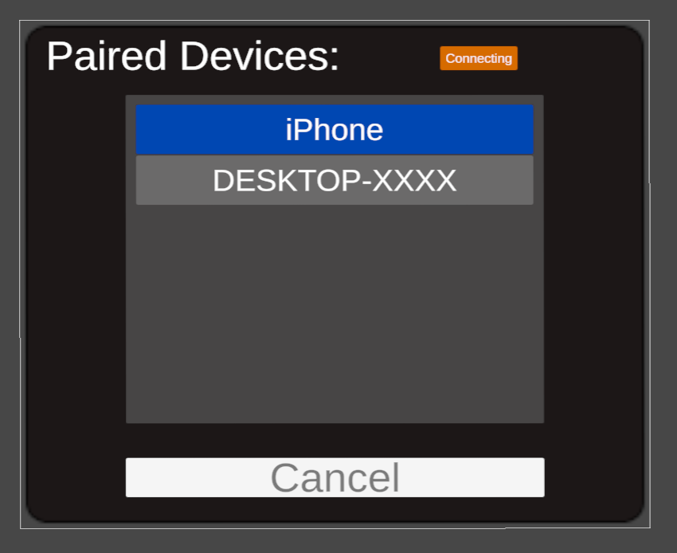

# UnityBluetoothSenderPlugin

Android plugin and implementation sample package for Bluetooth transmission from Unity.

[](https://opensource.org/licenses/MIT)
[](https://www.codefactor.io/repository/github/t-34400/unitybluetoothsenderplugin)


## Installation
1. Import the package.
2. Go to `File` > `Build Settings` from the menu bar, click on Android in the Platform tab of the dialog, and press the `Switch Platform` button.
3. Press the `Player Settings` button, check `Custom Main Manifest`, `Custom Main Gradle Template`, and `Custom Gradle Properties Template` under `Publishing Settings` > `Build`.
4. Edit the generated files as follows:
    - `Assets/Plugins/Android/AndroidManifest.xml`
        - Add the following tags below the `manifest` tag:
            ```xml
            <uses-permission android:name="android.permission.BLUETOOTH"
                android:maxSdkVersion="30" />
            <uses-permission android:name="android.permission.BLUETOOTH_ADMIN"
                android:maxSdkVersion="30" />
            <uses-permission android:name="android.permission.BLUETOOTH_SCAN" />
            <uses-permission android:name="android.permission.BLUETOOTH_ADVERTISE" />
            <uses-permission android:name="android.permission.BLUETOOTH_CONNECT" />
            ```
        - [Sample](./Plugins/Android/AndroidManifest.xml)
    - `Assets/Plugins/Android/mainTemplate.gradle`
        - Add the following to the dependencies at the bottom of the file:
            ```gradle
            implementation 'androidx.appcompat:appcompat:1.6.1'
            ```
        - [Sample](./Plugins/Android/mainTemplate.gradle)
    - `Assets/Plugins/Android/gradleTemplate.properties`
        - Append the following:
            ```
            android.useAndroidX=true
            android.enableJetifier=true
            ```
        - [Sample](./Plugins/Android/gradleTemplate.properties)

## Implementation in Scene
1. Attach the `BluetoothUnityInterface` component to any object in the scene.
2. Call each method of `BluetoothUnityInterface`.
    ```c#
    List<(string name, string address)> GetPairedDevices(); // Get the names and addresses of paired devices.
    void Connect(string address); // Connect to the device with the specified address.
    ConnectionStatus GetConnectionStatus(); // Check the connection status. (Disabled: Bluetooth is not available, Standby: Waiting for connection, Connecting: Establishing connection, Connected: Connection established)
    void Send(byte[] data); // Send data if connected.
    void Close(); // Close the connection.
    ```

## Communication Method
1. Pair with the target device and set up a Bluetooth server on the receiving device.
2. Use the `GetPairedDevices` method to obtain the addresses of paired devices, specify the address of the destination device, and establish a connection with the `Connect` method.
3. Check the connection status with the `GetConnectionStatus` method, and if it becomes Connected, call the `Send` method to send data.
4. When communication is finished, call the `Close` method to end the connection.

## Sample Prefab Usage
1. Add `Assets/BluetoothSender/DynamicToggleGroup` to the scene.
    - A version compatible with the Meta Interaction SDK is also included as `Assets/BluetoothSender/MetaDynamicToggleGroup`. Use it as needed.
2. Ensure that the `Send` method of the attached `BluetoothUnityInterface` component of `DynamicToggleGroup` can be called.
3. If you want to get notified of changes in connection status, register a listener with `UnityEvent<ConnectionStatus> onStatusChanged` of `BluetoothDeviceManager`.

### Usage in the Built App
1. If prompted for Bluetooth access permission when the app is launched, grant permission.
2. Pair with the destination device and set up a Bluetooth server on the receiving device.
3. Confirm that the connection status is Standby, select the paired device displayed, and press the Connect button.
4. Wait for the connection status to become Connected, and then send data.

- Connection Status Transition
   

## License
[MIT License](./LICENSE)
