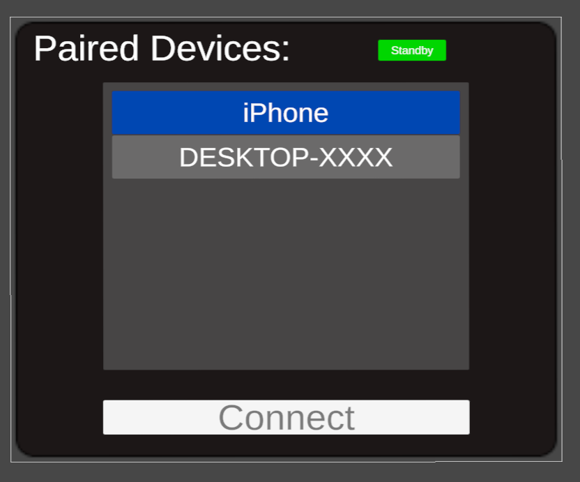
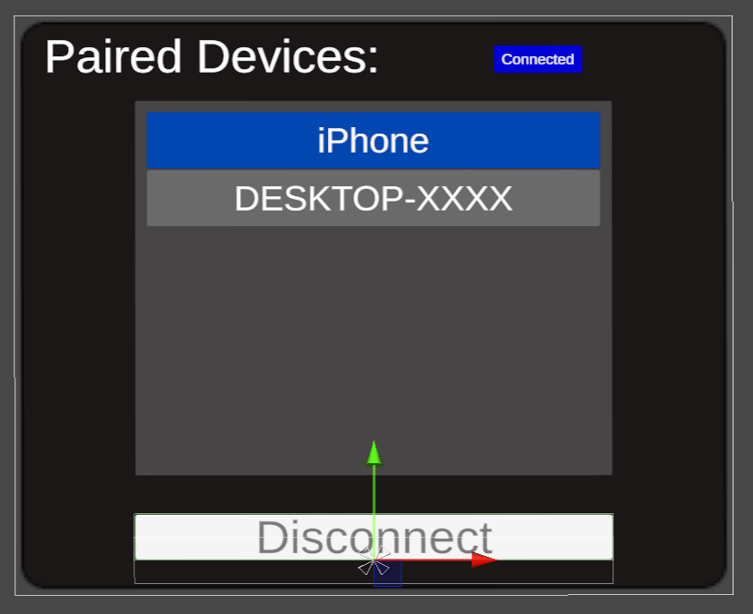
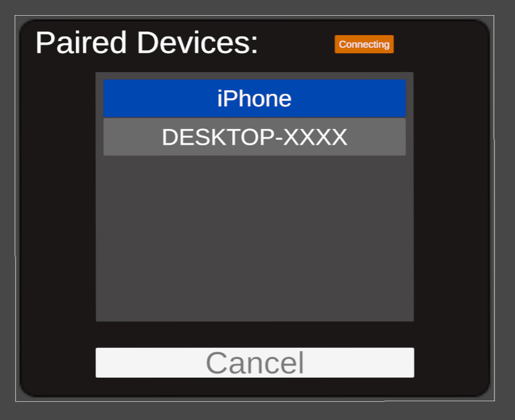
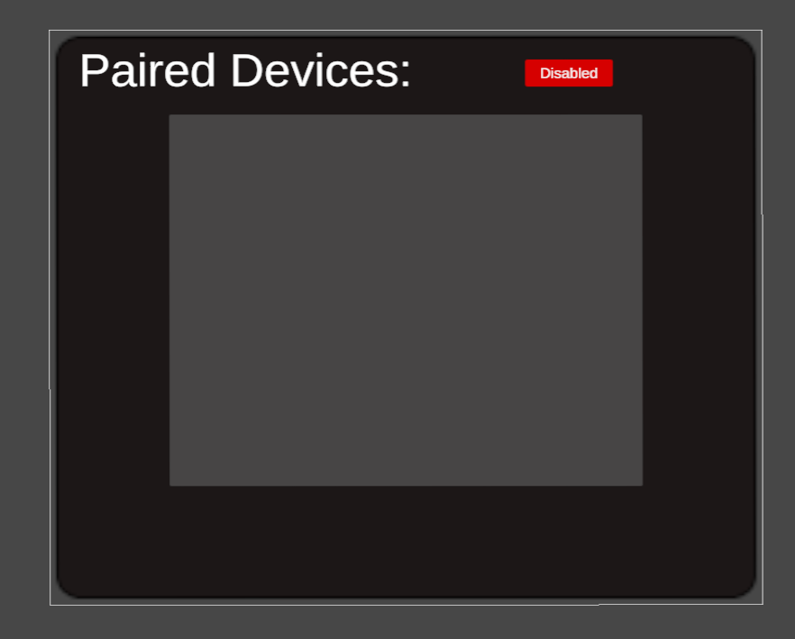

# UnityBluetoothSenderPlugin

UnityからBluetooth送信を行うためのAndroid Pluginと実装サンプルパッケージ.




## 導入方法
1. パッケージをインポートする
2. メニューバーから`File` > `Build Settings`を選び，ダイアログの`Platform`タブからAndroidをクリックし，`Switch Platform`ボタンを押す．
3. `Player Settings`ボタンを押し，`Publishing Settings` > `Build`以下の`Custom Main Manifest`, `Custom Main Gradle Template`, `Custom Gradle Properties Template`にチェックを入れる．
4. 3で生成された各ファイルを以下のように編集する．
    - `Assets/Plugins/Android/AndroidManifest.xml`
        - manifestタグ以下に次のタグを追加する．
            ```xml
            <uses-permission android:name="android.permission.BLUETOOTH"
                android:maxSdkVersion="30" />
            <uses-permission android:name="android.permission.BLUETOOTH_ADMIN"
                android:maxSdkVersion="30" />
            <uses-permission android:name="android.permission.BLUETOOTH_SCAN" />
            <uses-permission android:name="android.permission.BLUETOOTH_ADVERTISE" />
            <uses-permission android:name="android.permission.BLUETOOTH_CONNECT" />
            ```
        - [サンプル](./Plugins/Android/AndroidManifest.xml)
    - `Assets/Plugins/Android/mainTemplate.gradle`
        - ファイル最下部のdependenciesに以下を追加
            ```gradle
            implementation 'androidx.appcompat:appcompat:1.6.1'
            ```
        - [サンプル](./Plugins/Android/mainTemplate.gradle)
    - `Assets/Plugins/Android/gradleTemplate.properties`
        - 以下を追記する．
            ```
            android.useAndroidX=true
            android.enableJetifier=true
            ```
        - [サンプル](./Plugins/Android/gradleTemplate.properties)

## シーンへの実装方法
1. `BluetoothUnityInterface`コンポーネントをシーン内の任意のオブジェクトにアタッチする．
2. `BluetoothUnityInterface`の各メソッドを呼び出す．
    ```c#
    List<(string name, string address)> GetPairedDevices(); // ペアリング済みのデバイスの名前とアドレスと取得する．
    void Connect(string address); // 指定したアドレスのデバイスと接続する．
    ConnectionStatus GetConnectionStatus(); // 接続状況を確認する．(Disabled: Bluetoothが使用不能，Standby: 接続待ち，Connecting: 接続確立中，Connected: 接続済み)
    void Send(byte[] data); // 接続済みの場合にデータを送信する．
    void Close(); // 接続確立・接続を終了する．
    ```

## 通信方法
1. 送信先のデバイスとペアリングし，送信先のデバイスはBluetooth受信用のサーバーを立てる．
2. `GetPairedDevices`メソッドでペアリング済みのデバイスを取得し，接続先のデバイスのアドレスを指定し`Connect`メソッドで接続を確立する．
3. `GetConnectionStatus`メソッドで接続状況を確認し，Connectedになったらデータを`Send`メソッドを呼び出し送信する．
4. 通信が終了したら，`Close`メソッドを呼び出し接続を終了する．

## サンプルプレハブの使用方法
1. `Assets/BluetoothSender/DynamicToggleGroup`をシーンに追加する．
    - Meta interaction SDKに対応したバージョンとして，`Assets/BluetoothSender/MetaDynamicToggleGroup`プレハブも同梱しているので，適宜使い分ける．
2. `DynamicToggleGroup`にアタッチされている`BluetoothUnityInterface`コンポーネントの`Send`メソッドを呼び出せるようにする．
3. 接続状態の変化を取得したい場合は，`BluetoothDeviceManager`の`UnityEvent<ConnectionStatus> onStatusChanged`にリスナーを登録する．

### ビルドアプリ上での使用方法
1. アプリ起動時にBluetoothへのアクセス権限が求められる場合は，許可する．
2. 送信先のデバイスとペアリングし，送信先のデバイスはBluetooth受信用のサーバーを立てる．
3. 接続状態がStandbyとなっていることを確認して，表示されているペアリング済みデバイスを選択し，Connectボタンを押す．
4. 接続状態がConnectedになるのを待ち，データを送信する．

- 接続状態の推移
   

## License
[MIT License](./LICENSE)